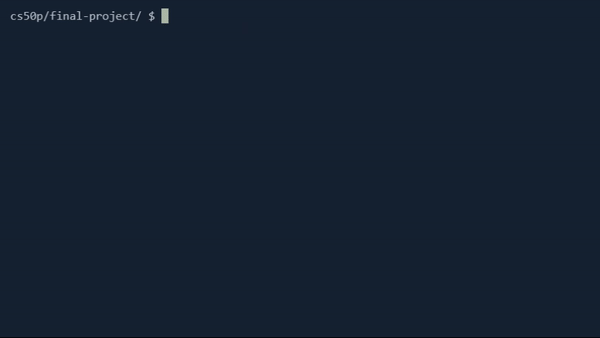

# Kanji and Kana Anki Quiz - CS50P 2025 Final Project

### Description:
**Kanji and Kana Anki Quiz** is a simple *quiz game* developed in python playable directly in the terminal. It can be used to practice Japanese kanji and kana through a similar system to anki.

At first you need to create a **user**, or log in if it's not your first time playing. This step is needed to create or retrieve an entry in the *database* and to update its scores. For the sake of `test_project.py` an already existing database is provided. If testing is not needed, you can delete the database and a new empty one will be automatically created next time you run the program.

Even if every single user has a unique ID, no duplicate usernames are allowed. For security reasons, usernames may contain only alphanumeric and alphabetical characters, and have to be between 2 and 10 characters. To log in you simply type your username when prompted, no password needed as the program database is stored locally.

Once logged, you can play one type of **kana quiz** (no dakutens), or two different types of **kanji quizzes**. When selecting one of the kanji quizzes, you can choose the **JLPT** level. The *kana quiz* uses the `kana.csv` file to retrieve a random kana (either hiragana or katakana), while the *kanji quizzes* use the **JLPT vocab API** random search with the JLPT level as query. Every time you complete a game your *scores* in the database are updated.

Finally, you can view your **scores**, which consist in the *total number of games played*, *total points* (1 correct answer = 1 point) and *correct answers percentage* calculated accordingly.

Since it is a simple program, there is minimal personalized classes usage (only `WordDict`). For an easier debugging, both `mypy` with type hints and `pytest` have been used. Several comments have been added for an easier code understanding.

### Installation:
This program runs in the terminal with python, so you have to have python installed.

Install all packages from `requiremenmts.txt` with `pip install -r requirements.txt`. Non required but suggested, you can delete the database `users.db` and a new empty one will be created next time you launch the program. Keep in mind that the tests in `test_project.py` will not pass anymore.

### Additional credits:
[JLPT vocab API](https://github.com/wkei/jlpt-vocab-api) by wkei

##### Disclaimer: English is not my first language so I apologize for any mistakes.
